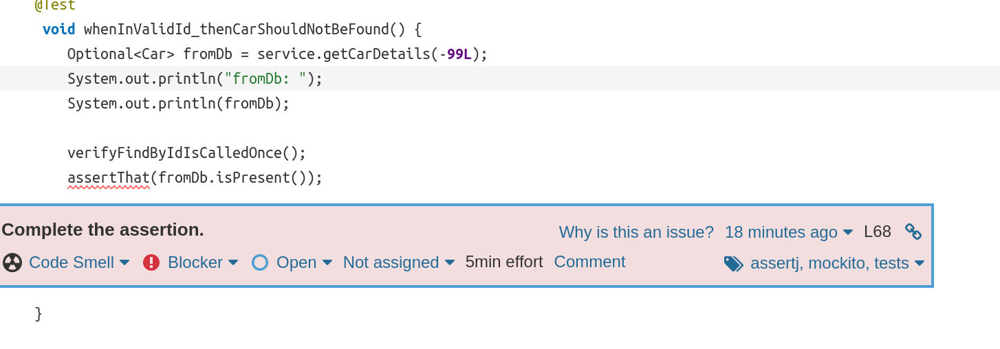

# Lab 6.3

a) Um technical debt recorrente ao redor desse projeto foi o uso de `public` nos métodos da classe do Controller, Repository e em alguns testes. Segundo o Sonar, não é mais necessário utilizar isso, e sim pôr como alcance de visualização da própria package.

Já no teste do service, acabou ocorrendo um assert em que nada acontecia realmente (faltando confirmar que aquele assert era true).

d) Existem 7 linhas que não foram visualizadas.
