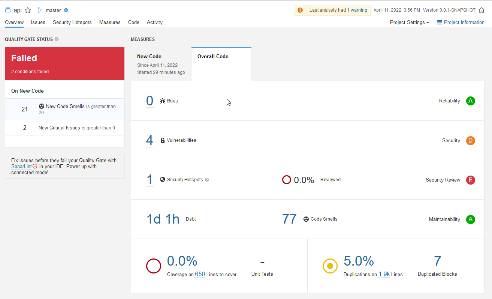

# Lab 6.4

Seguindo a estrutura do dashboard:

a) 

* Sem bugs (mesmo que ao custo de features, a falta de bugs sempre será prioritária)
* 20 ou menos code smells (muitos code smells existentes foram em razão de imports inutilizados ou convenção de variáveis. 20 parece ser um número adequado pelo tempo curto do projeto)
* Sem critical issues (erros que paralizam a aplicação não podem ir para a versão final)
* 10 ou menos major issues (para deixar o projeto mais robusto)
* 2 ou menos vulnerabilidades (tivemos 4 ao total (todas relacionadas com o uso/desuso de DTOs), que poderiam ter sido consertadas, porém pelo prazo do projeto podíamos aceitar metade incompleta)

b) Adicionando smell codes fáceis como imports não utilizados e nomes de variáveis que não seguem à norma, é possível visualizar 21 novos code smells e 2 novos critical issues, quebrando então o quality gates, que indica que passamos do limite.

